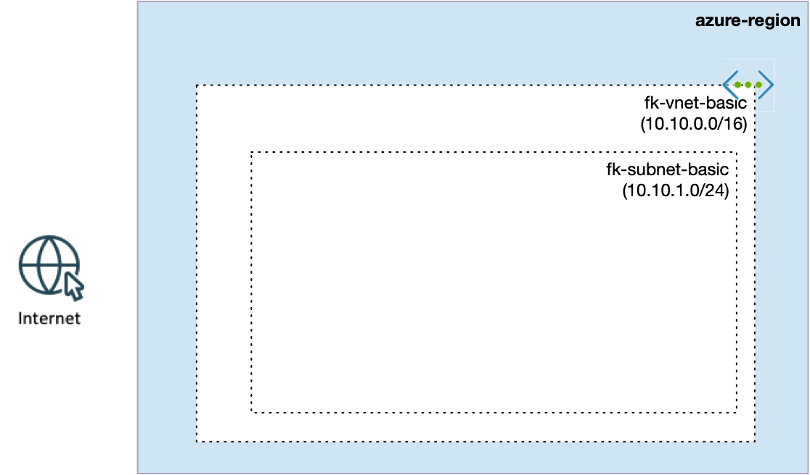

# Example 01: Basic Azure VNet

In this first example, we deploy a **minimal Azure Virtual Network (VNet)** using **Terraform/OpenTofu**.
All resources are created from scratch — **Resource Group, Virtual Network, and a single Subnet** —
making this a perfect starting point for anyone new to Azure networking or Infrastructure as Code.

This example is intentionally simple and focuses only on the **networking foundation**,
without AKS, Private Endpoints, or additional services.

---

## 🧭 Architecture Overview



This deployment creates:
- A new **Resource Group**.
- A single **Virtual Network (VNet)**.
- One **Subnet** inside the VNet.

There are no Network Security Groups, route tables, or service integrations in this example.
The goal is to understand the **absolute basics of Azure VNet provisioning**.

---

## 🚀 Deployment Steps

Initialize and apply the Terraform/OpenTofu configuration:

```bash
tofu init
tofu plan
tofu apply
```

After a successful deployment, Terraform will output:
- The VNet ID
- The Subnet ID

These outputs are used in later examples as building blocks.

---

## 🖼️ Azure Portal View

After deployment, you should see:
- A single VNet with one subnet in the Azure Portal
- No additional networking components attached

This is the simplest possible Azure network layout.

---

## 🧹 Cleanup

To remove all resources created by this example:

```bash
tofu destroy
```

---

## ✅ Summary

This example demonstrates:
- How to create a **basic Azure Virtual Network** using Terraform/OpenTofu
- How VNet address space and subnet CIDR blocks are defined
- The foundation upon which more advanced scenarios (AKS, Private Endpoints) are built

---

## 🌐 Learn More

Visit [FoggyKitchen.com](https://foggykitchen.com/) for Azure, multicloud, and Terraform/OpenTofu learning resources.

---

## 🪪 License

Licensed under the **Universal Permissive License (UPL), Version 1.0**.  
See [LICENSE](../../LICENSE) for more details.

