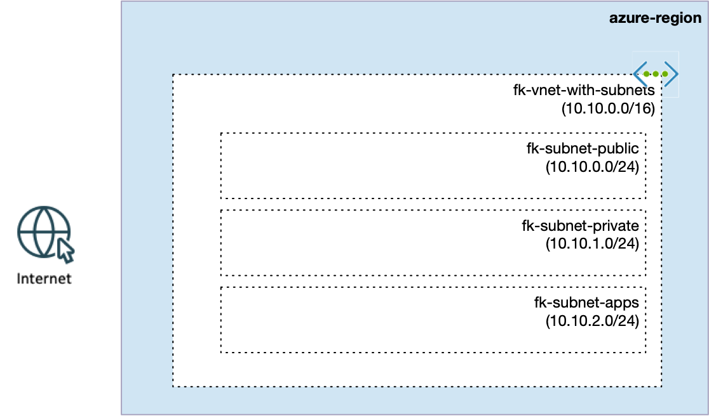
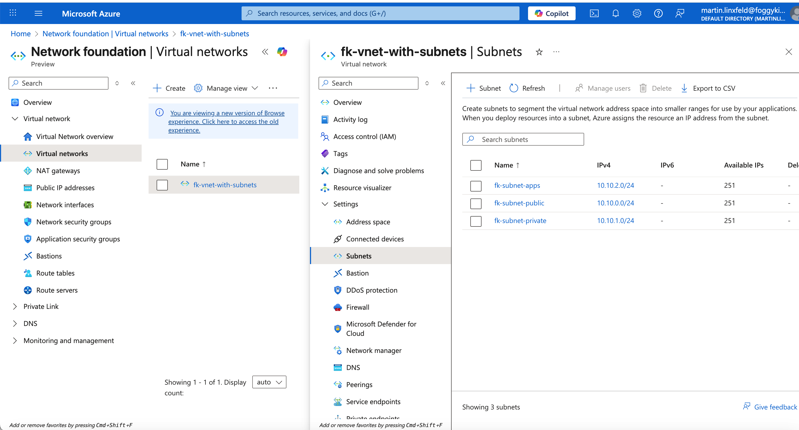

# Example 02: Azure VNet with Multiple Subnets

In this example, we extend the basic VNet from **Example 01** by introducing **multiple subnets**
and a simple **Service Endpoint** configuration.

This scenario represents a very common real-world step:
moving from a single flat network to a **structured VNet layout** that separates workloads
and prepares the network for future services.

---

## 🧭 Architecture Overview



This deployment creates:
- A new **Resource Group**.
- A **Virtual Network (VNet)**.
- Multiple **Subnets**, each with a clear purpose:
  - `fk-subnet-public` – placeholder for public-facing components (e.g. Load Balancer, Bastion).
  - `fk-subnet-private` – subnet for internal workloads or virtual machines.
  - `fk-subnet-apps` – subnet for application-level resources.

Additionally:
- The `fk-subnet-private` subnet is configured with a **Service Endpoint** for Azure Storage.

> At this stage, the subnets are about **network structure**, not yet about deployed services.
> Real consumers of these subnets appear in later examples.

---

## 🚀 Deployment Steps

Initialize and apply the Terraform/OpenTofu configuration:

```bash
tofu init
tofu plan
tofu apply
```

After a successful deployment, Terraform will output:
- The VNet ID
- A map of Subnet IDs (by subnet name)

These outputs are reused in later examples as building blocks.

---

## 🖼️ Azure Portal View



After deployment, you should see:
- One Virtual Network with multiple subnets:
  - `fk-subnet-public`
  - `fk-subnet-private`
  - `fk-subnet-apps`
- Each subnet assigned its own CIDR block
- No compute or platform services deployed yet

This view highlights the **logical network structure** created in this example,
before any workloads or platform services are introduced.

---

## 🧹 Cleanup

To remove all resources created by this example:

```bash
tofu destroy
```

---

## ✅ Summary

This example demonstrates:
- How to define **multiple subnets** within a single VNet
- How to use **Service Endpoints** at the subnet level
- How to structure a VNet for future expansion without over-engineering

This layout is a natural bridge between a basic VNet and service-specific networks
such as AKS-ready or Private Endpoint–ready designs.

---

## 🌐 Learn More

Visit [FoggyKitchen.com](https://foggykitchen.com/) for Azure networking,
Terraform/OpenTofu examples, and multicloud architecture patterns.

---

## 🪪 License

Licensed under the **Universal Permissive License (UPL), Version 1.0**.  
See [LICENSE](../../LICENSE) for more details.

