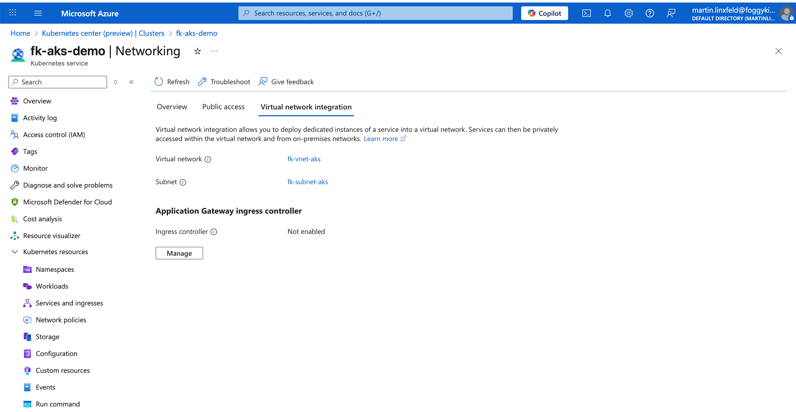

# Example 03: AKS Minimal Network

In this example, we move beyond pure networking structure and deploy the **first real consumer of a subnet**:
an **Azure Kubernetes Service (AKS)** cluster.

This example intentionally keeps the network **minimal and purpose-driven** — a single subnet,
sized correctly for AKS, with no placeholder or unused components.

---

## 🧭 Architecture Overview


This deployment creates:
- A new **Resource Group**
- A **Virtual Network (VNet)**
- A single **AKS-dedicated subnet**
- An **AKS cluster** deployed into that subnet

The key idea is simple:

> The subnet exists **because AKS uses it** — not “just in case”.

There are no additional subnets, no Bastion, no Private Endpoints yet.
Those appear only when they are actually required.

---

## 🧠 Why a Dedicated AKS Subnet?

AKS places **nodes, pods, and load balancer resources** inside the subnet.
For that reason, the subnet:
- Should be **larger than a typical VM subnet**
- Is commonly sized as `/22` or larger
- Should be treated as a long-lived networking decision

This example reflects that best practice.

---

## 🚀 Deployment Steps

Initialize and apply the Terraform/OpenTofu configuration:

```bash
tofu init
tofu plan
tofu apply
```

After a successful deployment, Terraform will output:
- The VNet ID
- The AKS subnet ID
- AKS cluster identifiers

You can verify the cluster using Azure CLI:

```bash
az aks get-credentials -g <resource-group> -n <aks-name>
kubectl get nodes
```

> The AKS control plane is **public** in this example,
> allowing direct access from your workstation.

---

## 🖼️ Azure Portal View



After deployment, you should see:
- An AKS cluster (`fk-aks-demo`) integrated with an existing Virtual Network
- The cluster deployed into a dedicated subnet (`fk-subnet-aks`)
- No ingress controller or additional platform integrations enabled

This view confirms that the AKS cluster is correctly **anchored inside the VNet**,
forming a clean foundation for further networking and security extensions.

---

## 🧹 Cleanup

To remove all resources created by this example:

```bash
tofu destroy
```

---

## ✅ Summary

This example demonstrates:
- How to design a **minimal AKS-ready network**
- Why AKS deserves a **dedicated subnet**
- How a subnet becomes “alive” only when consumed by a service

This example is a critical bridge between **pure networking**
and **service-driven architecture**.

---

## 🌐 Learn More

- [FoggyKitchen.com](https://foggykitchen.com)
- AKS with Terraform/OpenTofu (Hands-On Fundamentals)
- Multicloud Foundations: Azure & OCI

---

## 🪪 License

Licensed under the **Universal Permissive License (UPL), Version 1.0**.  
See [LICENSE](../../LICENSE) for more details.

