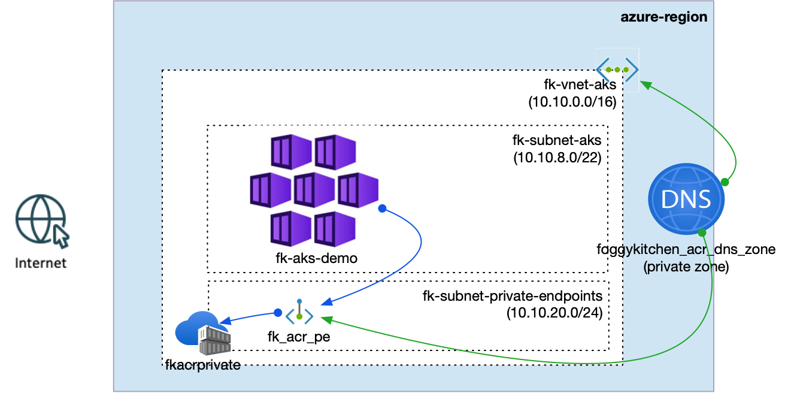

# Example 04: Private Endpoints Ready

In this example, we extend the **AKS minimal network** from Example 03 by introducing a
**dedicated subnet for Private Endpoints** and connecting **Azure Container Registry (ACR)**
to the Virtual Network using a **Private Endpoint**.

This example demonstrates a key Azure networking concept:

> A PaaS service does not live inside your VNet —  
> but its **Private Endpoint does**.

---

## 🧭 Architecture Overview



This deployment creates:
- A new **Resource Group**
- A **Virtual Network (VNet)**
- An **AKS-dedicated subnet** (used by the AKS cluster)
- A **Private Endpoints subnet** with network policies disabled
- An **Azure Container Registry (ACR)**
- A **Private Endpoint** connecting ACR to the VNet

The result is a **fully private connectivity path** between AKS and ACR,
without exposing ACR to the public internet.

---

## 🧠 Why a Dedicated Private Endpoints Subnet?

Private Endpoints require a subnet with:

```hcl
private_endpoint_network_policies = "Disabled"
```

Best practice is to:
- Use a **separate subnet** for Private Endpoints
- Treat it as a **shared connectivity layer**
- Plan for **multiple Private Endpoints over time** (Storage, Key Vault, SQL, etc.)

This example follows that pattern explicitly.

---

## 🚀 Deployment Steps

Initialize and apply the Terraform/OpenTofu configuration:

```bash
tofu init
tofu plan
tofu apply
```

After a successful deployment, Terraform will output:
- The VNet ID
- AKS subnet ID
- Private Endpoints subnet ID
- Private Endpoint IP address

You can verify the Private Endpoint in the Azure Portal:
- Virtual Network → Subnets → `fk-subnet-private-endpoints`
- Private Endpoint → Network Interface → Private IP

---

## 🧹 Cleanup

To remove all resources created by this example:

```bash
tofu destroy
```

---

## ✅ Summary

This example demonstrates:
- How to design a **Private Endpoint–ready network**
- Why Private Endpoints should live in a **dedicated subnet**
- How AKS securely accesses ACR without public exposure
- The transition from **network structure** to **secure service connectivity**

This example completes the foundational Azure VNet journey:
**basic → structured → AKS-ready → private-by-design**.

---

## 🌐 Learn More

- [FoggyKitchen.com](https://foggykitchen.com)
- AKS with Terraform/OpenTofu (Hands-On Fundamentals)
- Multicloud Foundations: Azure & OCI

---

## 🪪 License

Licensed under the **Universal Permissive License (UPL), Version 1.0**.  
See [LICENSE](../../LICENSE) for more details.

