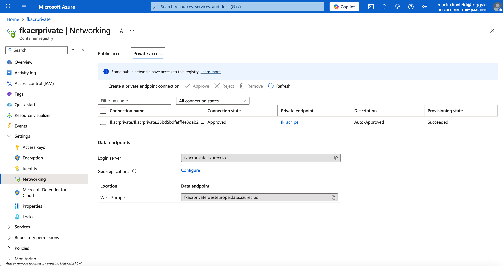
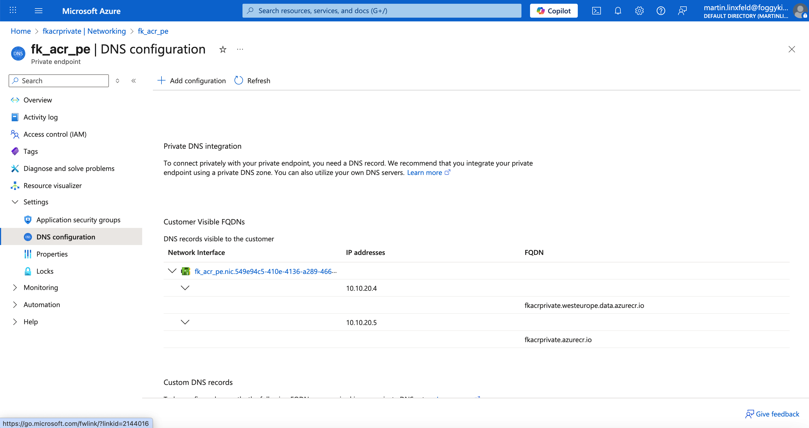

# Example 04: AKS + Azure Container Registry with Private Endpoint

In this example, we extend the previous AKS deployment by adding **Private Endpoint connectivity** to an **Azure Container Registry (ACR)**.

The goal is to demonstrate how **Azure Private Endpoints work in practice**, including:
- subnet separation,
- private DNS resolution,
- and secure, private access to a PaaS service from AKS.

This example intentionally focuses on **networking mechanics**, not application workloads.

---

## 🧭 Architecture Overview

This deployment creates:

- A dedicated **Virtual Network** (`fk-vnet-aks`)
- An **AKS subnet** used by the Kubernetes cluster  
- A **Private Endpoint subnet** dedicated to PaaS private endpoints
- An **Azure Container Registry** with:
  - public access disabled (or restricted)
  - **Private Endpoint enabled**
- A **Private DNS Zone** linked to the VNet

Traffic from AKS to ACR flows **entirely inside the virtual network**, without using public IPs.

---

## 🧱 Network Layout

- **VNet CIDR:** `10.10.0.0/16`
- **AKS subnet:** `10.10.8.0/22`
- **Private Endpoint subnet:** `10.10.20.0/24`

Each subnet has a clear, single responsibility:
- AKS nodes run only in the AKS subnet
- Private Endpoints live only in the Private Endpoint subnet

---

## 🚀 Deployment Steps

Initialize and apply the configuration:

```bash
tofu init
tofu plan
tofu apply
```

After the deployment completes, AKS and ACR are fully provisioned and connected through a Private Endpoint.

---

## 🖼️ Azure Portal View – Private Access



After deployment, you should see the Azure Container Registry configured with **Private access**.

- A Private Endpoint connection is present
- The connection state is **Approved**
- The registry still uses the standard `*.azurecr.io` endpoint
- No public IP exposure is required

This confirms that ACR access is now handled through a private network path.

---

## 🌐 Private Endpoint DNS Resolution



Private Endpoints do **not** introduce new service URLs.  
Instead, they work by **overriding DNS resolution** for existing service FQDNs.

The screenshot below shows the DNS configuration of the Private Endpoint:

- Standard ACR FQDNs are preserved:
  - `fkacrprivate.azurecr.io`
  - `fkacrprivate.westeurope.data.azurecr.io`
- DNS records resolve to **private IP addresses**
- The IPs belong to the **Private Endpoint subnet**
- No public IP addresses are used

This confirms that traffic to ACR is routed privately through the VNet.

---

## 🧠 Key Takeaways

This example demonstrates that:

- Private Endpoints secure access to Azure PaaS services **without changing service endpoints**
- DNS resolution is the key mechanism behind Private Endpoint connectivity
- Subnet separation is critical for clean and secure network design
- AKS can securely consume private PaaS services using standard Azure networking primitives

---

## 🧹 Cleanup

To remove all resources created by this example:

```bash
tofu destroy
```

---

## 🌐 Learn More

Visit [FoggyKitchen.com](https://foggykitchen.com/) for:
- Azure & OCI networking deep dives
- AKS and multicloud Terraform examples
- Hands-on Infrastructure as Code training

---

## 🪪 License

Licensed under the **Universal Permissive License (UPL), Version 1.0**.  
See [LICENSE](../../LICENSE) for details.

---

© 2025 [FoggyKitchen.com](https://foggykitchen.com) — *Cloud. Code. Clarity.*
